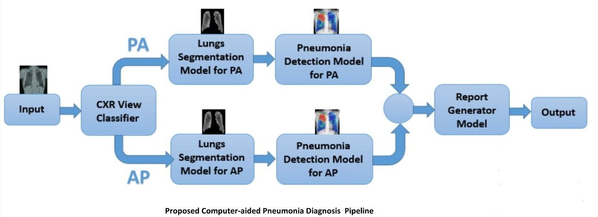

#  Development of a Novel Computer-Aided Pneumonia Diagnosis System

### Chest X-ray View Classification 
> Feature extraction - <a href="https://github.com/sakibreza/Pneumonia-Diagnosis-System/blob/master/PA_vs_AP_feature_extraction.ipynb">sample code</a>

> Feature selection - <a href="https://github.com/sakibreza/Pneumonia-Diagnosis-System/blob/master/Feature_selection_GA.ipynb">sample code</a>

> Classification - <a href="https://github.com/sakibreza/Pneumonia-Diagnosis-System/blob/master/View_classification.ipynb">sample code</a>

### Lungs Segmentation 

> Lungs segmentation model - <a href="https://github.com/sakibreza/Pneumonia-Diagnosis-System/blob/master/Segmentation_model.ipynb">sample code</a>

### Pneumonia Detection

> Pneumonia detection model - <a href="#">will be added soon</a>

### Fuzzy Pneumonia Assessment System (Report Generator)
> Fuzzy inference system - <a href="https://github.com/sakibreza/Pneumonia-Diagnosis-System/blob/master/Pneumonia_FIS.ipynb">sample code</a>
